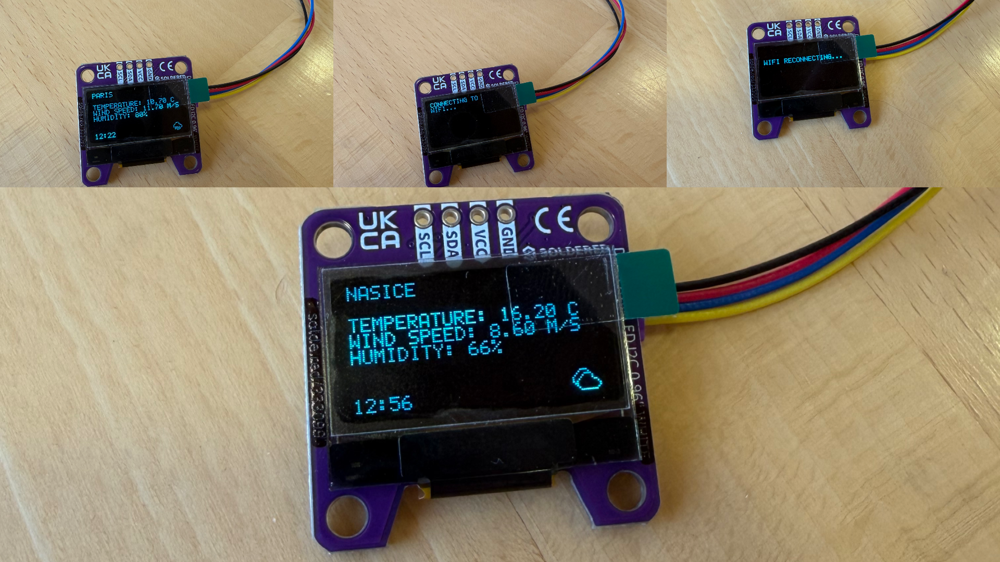
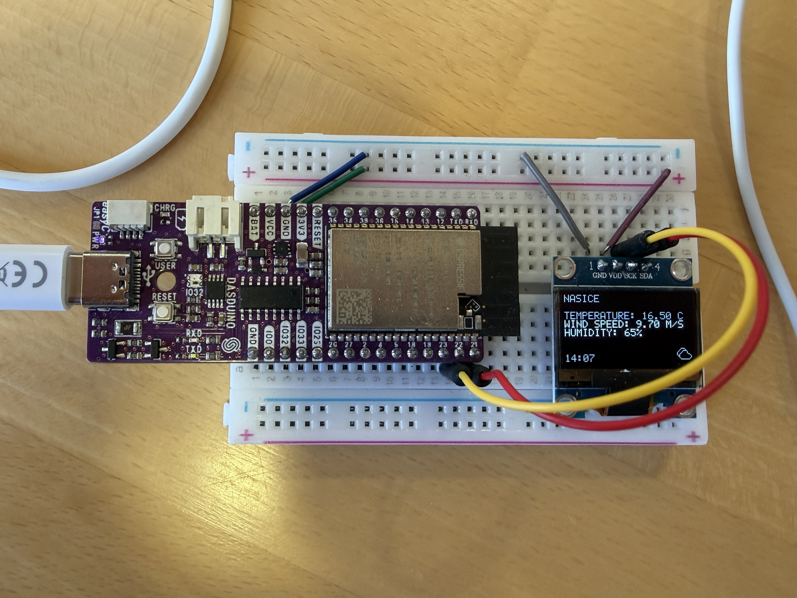

# ESP Weather Station

ESP32 project that gets weather data using the Open-Meteo API and displays it on an OLED display alongside the location, a small icon representing the weather, and current time.





## How it works

### Main program

Upon boot, ESP tries to connect to the provided WiFi and set up local time to the current time in CET timezone, displays current location, time, and weather with updates every minute.
If WiFi disconnects, the system alerts the user and tries to reconnnect, and, if an HTTP error occurs, it is also displayed to the user.

The main program consists of two FreeRTOS tasks. `watchdogTask` is used for monitoring the WiFi connection and, in the event of WiFi disconnecting, attempts to reconnect while informing the user. `displayTask` is responsible for fetching the weather data and displaying it to the user.

Since both tasks need to interact with display and WiFi it is important to make them synchronised so that they don't access the same instance at the same time. For synchronisation the **FreeRTOS task notifications** are used.

### SSD1306

The project uses a custom SSD1306 driver with custom I2C communication. For usage example check out `SSD1306.h`.

The driver is somewhat barebones, allowing the user to print a string at a desired line and aligned either to the right, centered or to the left, draw bitmap at a desired position and to start scrolling line (or lines) to the left or to the right.

If you wish to display more complex things like animations it is recommended to use an external library.

### Network

The project connects to your WiFi network and performs the following:
- sets up local time using SNTP 

> [!IMPORTANT]
> If you with to change the timezone it you can do so in `wifi.cpp` in `setCurrentTime` function.

- gets coordinates for the input location using [Open Meteo Geocoding API](https://open-meteo.com/en/docs/geocoding-api)
- gets weather information for your location using [Open Meteo Forecast API](https://open-meteo.com/en/docs)

## Project Structure

```shell
src/
├── CMakeLists.txt
└── main
    ├── CMakeLists.txt
    ├── Kconfig.projbuild
    ├── idf_component.yml
    ├── include
    │   ├── I2C.h
    │   ├── SSD1306.h
    │   ├── font.h
    │   ├── http.h
    │   ├── print_utils.h
    │   └── wifi.h
    ├── lib
    │   ├── I2C.cpp
    │   ├── SSD1306.cpp
    │   ├── http.cpp
    │   ├── print_utils.cpp
    │   └── wifi.cpp
    └── main.cpp
```

## Prerequisites

### Hardware

- ESP32
  - any board with WiFi support should work, but the project was tested using [ESP32-C6-MINI-1](https://soldered.com/products/nula-mini-esp32-c6?srsltid=AfmBOooTO54ZQxV41nlYx_qWr5AFgaa8gkWDSMmL5zmYyqjJGM4XuMaw$0) and ESP32-WROVER-E boards
- [SSD1306 display](https://soldered.com/products/display-oled-i2c-white-0-96-ssd1306?variant=62540973343069$0)
  - if you wish to display data using an OLED display, alternatively, you can use the serial monitor instead of the display
  - both the [QWIIC cable](https://docs.soldered.com/qwiic) and regular wiring are supported; see [wiring](#wiring) for details

Example output in serial monitor:
```shell
I (5776) ESP32-WEATHER: Refreshing data...
I (5916) ESP32_PRINT: NASICE
I (5916) ESP32_PRINT: Temperature: 9.60 C
I (5926) ESP32_PRINT: Wind speed: 21.60 m/s
I (5936) ESP32_PRINT: Humidity: 60%
I (5946) ESP32_PRINT: 18.03 09:58
```

### Software

- ESP-IDF v5.0 or above
  - for installation instructions check out the [official documentation](https://docs.espressif.com/projects/esp-idf/en/stable/esp32/get-started/index.html#installation)

## Installation

### Wiring

If using QWIIC cable, simply connect the ESP and OLED display with it. Otherwise, refer to your ESP and display documentation and wire accordingly.

### Building and running the project

Clone the project and position yourself in `src` folder using:
```shell
git clone https://github.com/franFodor/esp-oled-weather
cd esp-oled-weather
cd src
```

Set your ESP target using:
```shell
idf.py set-target
# eg
# idf.py set-target esp32c6
```

Before flashing the firmware, you must configure the project using:

```shell
idf.py menuconfig
```

Here you need to configure three things:

1. **I2C Configuration**
   - if you are using the same setup as described above (ESP32-C6-MINI-1 with QWIIC), you can leave the defaults. Otherwise, set the pins according to your wiring

2. **WiFi Configuration**
   - enter the SSID and password of your network

3. **Weather Location**
   - set the desired location to display weather for

After configuration, build the project:
```shell
idf.py build
```
Flash the firmware:
```shell
idf.py -p PORT flash
```

> [!TIP]
> If you don't know which port your ESP is connected to refer to [official documentation](https://docs.espressif.com/projects/esp-idf/en/stable/esp32/get-started/establish-serial-connection.html).

And, if you wish, you can open the serial monitor:
```shell
idf.py -p PORT monitor
```
Alternatively, you can run this one command to perform everything:
```shell
idf.py -p PORT build flash monitor
```

> [!TIP]
> If its your first time running the program it is recommended to monitor the board using serial monitor in case any errors occur.
